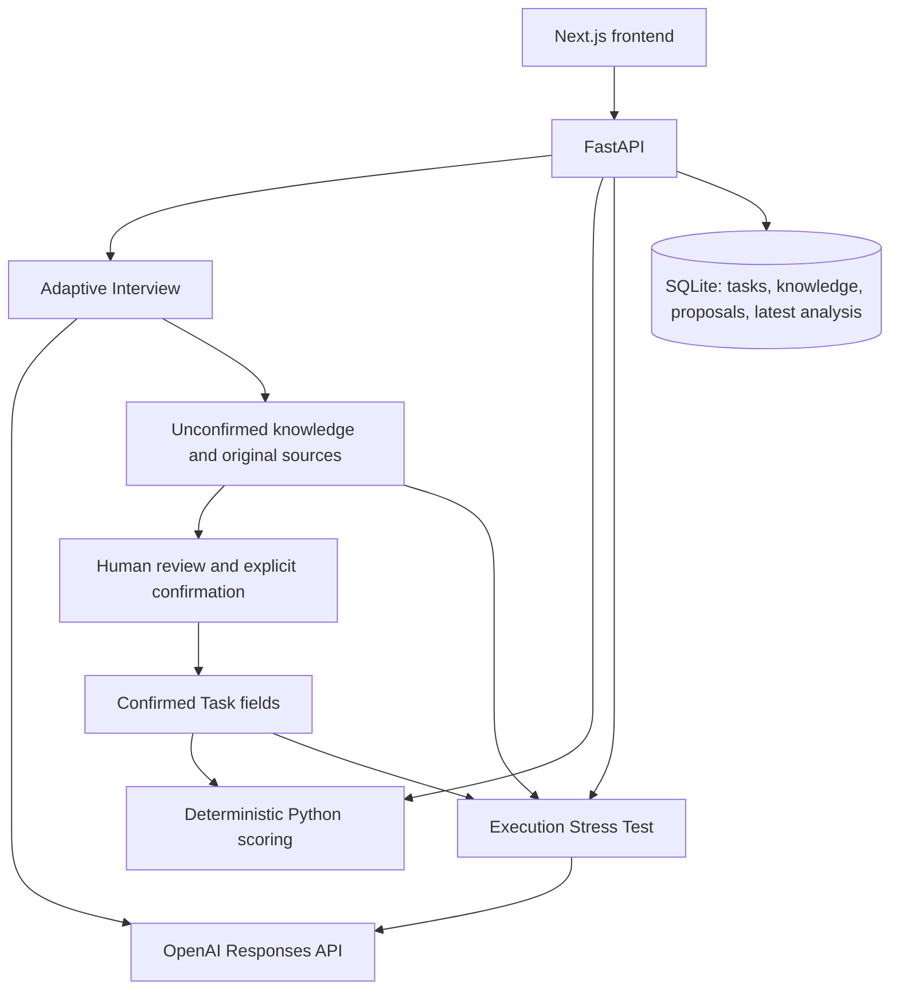

# AI Sana Challenge Hub

Turn an unclear business problem into a source-grounded challenge that student
teams can understand, question, and propose work on.

**Businesses should not need to know how to write technical specifications.
They only need to understand their problem.**

Business problem → Adaptive Interview → Knowledge Map → Human Confirmation →
Readiness Score → Execution Stress Test → Marketplace → Student Proposal →
Manual Business Decision

Built for HACKALEM by Adil_Alem, with fictional Kazakhstan-oriented demo challenges.
[Run the demo](DEMO.md) · [Backend/API guide](backend/README.md) ·
[Frontend guide](frontend/README.md)

## The problem and solution

Businesses understand operational problems but often cannot turn them into tasks
students can safely begin. Information may be missing, unknown, held by another
expert, conflicting, or unconfirmed. Teams then start with different assumptions.

The **adaptive AI interview** asks small batches of clarification questions. A
**Knowledge Map** preserves original contributions and distinguishes those states.
People review and confirm information; a **deterministic readiness engine** measures
its completeness. An **Execution Stress Test** identifies task-specific blockers.
The **open marketplace** accepts published challenges at every readiness level.
Students submit original proposals, and businesses **manually accept or reject** them.

AI structures business knowledge; it is not its source of truth. Unknown is valid
data. Original human information stays available, and AI interpretations remain
unconfirmed until a person confirms them. AI never chooses a team.

## Readiness is not executability

| Readiness | Execution Stress Test |
| --- | --- |
| Deterministic Python rules; never calculated by AI | AI-assisted, source-grounded diagnostic |
| 0–100 completeness of confirmed information | Five adaptive gates: UNDERSTAND, START, ACCESS, VALIDATE, DELIVER |
| Shows what needs confirmation or clarification | Shows passed gates, blockers, and not-applicable requirements |
| 100/100 does not predict project success | No second percentage; does not prevent publication |

Neither predicts project success or selects a team. A challenge can be published
with unresolved information and execution blockers.

## Architecture and stack



- **Frontend:** Next.js, React, TypeScript, Tailwind CSS.
- **Backend:** Python 3.10+, FastAPI, SQLAlchemy, SQLite, Pydantic, Uvicorn.
- **AI:** OpenAI Responses API, `gpt-5.4-mini`, Pydantic Structured Outputs.
- **Tests:** Python unittest, FastAPI TestClient/HTTPX, live Uvicorn HTTP smoke
  checks, Playwright with Google Chrome, TypeScript, Next.js production build.

## Quick start

Prerequisites: Git, Python 3.10+, Node.js 20.9+ with npm. Live interview and stress
tests require an OpenAI API key with access to `gpt-5.4-mini`; catalog, proposals,
and deterministic scoring work without it. Google Chrome is needed for browser tests.

Run the following from the cloned repository root. Keep two terminals open.

**Terminal 1 — backend (PowerShell):**

```powershell
cd backend
python -m venv .venv
.\.venv\Scripts\Activate.ps1
python -m pip install -r requirements.txt
Copy-Item .env.example .env
```

**macOS/Linux equivalent:**

```bash
cd backend
python3 -m venv .venv
source .venv/bin/activate
python -m pip install -r requirements.txt
cp .env.example .env
```

Edit `backend/.env` locally (never commit it):

```dotenv
DATABASE_URL=sqlite:///./sana.db
OPENAI_API_KEY=YOUR_OPENAI_API_KEY
OPENAI_MODEL=gpt-5.4-mini
```

Then, in that same terminal on either platform:

```bash
python seed.py
python -m uvicorn app.main:app --reload --host 127.0.0.1 --port 8000 --env-file .env
```

If PowerShell blocks activation, use `.\.venv\Scripts\python.exe` instead of
`python`. `seed.py` does not load `.env`; with the default URL above both commands
use `backend/sana.db`. For another database, set `DATABASE_URL` in the shell for
both commands (see [DEMO.md](DEMO.md)). Shell variables override the env file.

**Terminal 2 — frontend (from the repository root):**

```powershell
cd frontend
npm ci
Copy-Item .env.example .env.local
npm run dev
```

On macOS/Linux use `cp .env.example .env.local` instead of `Copy-Item`.
The example sets `NEXT_PUBLIC_API_URL=http://127.0.0.1:8000`.
Never put an OpenAI key in frontend configuration.

Open **http://localhost:3000**. API docs: **http://127.0.0.1:8000/docs**.
Health: **http://127.0.0.1:8000/health**. Use `localhost:3000` for the frontend;
that is the configured CORS origin. Tables are created automatically.

## Demo data

From `backend/` with its virtual environment active:

```bash
python seed.py
python seed.py --reset
```

Seeding creates 8 published challenges across all four readiness levels, 5 teams,
and 9 proposals with pending/accepted/rejected states. Companies, contacts, and
projects are fictional; `example.com` prototype links are placeholders.
Repeating the first command preserves existing demo edits. `--reset` replaces
only seed-owned rows; it refuses if they have interview history or non-demo
proposal references. It does not reset a whole operator session. See the
[safe baseline reset](DEMO.md#return-to-baseline) for that case.

Authentication is intentionally absent. **Student/Business is demo navigation**,
not identity or permission enforcement; all businesses' records are visible.

## Verify the complete solution

Allow about five minutes after installation; live AI response times vary.

1. Start the seeded backend and frontend above. Open **Business → New challenge**.
2. Give it a title, e.g. **Contract review pilot**, and this synthetic description:

   > Our employees spend too much time reviewing contracts.
   > We want to automate this process.

3. Complete part of the adaptive interview. For the specific need, a safe test
   fact is: “We need to identify clauses that differ from our approved contract
   template.” This is new human input, not something AI should infer.
4. Use **I don't know** for an unknown item and **Needs another expert** with
   **IT department** for the data/access question when it appears. Question order
   varies. Inspect the Knowledge Map and original sources.
5. Review known values, **Save reviewed value**, then **Confirm field**. Observe
   readiness change. Leave genuine unknowns unresolved; **Finish for now** is allowed.
6. Select **Run execution test**. Expand a blocker and its sources. Expect unresolved
   access to remain unresolved, not invented. Exact gate counts can vary.
7. In **Marketplace publication**, review readiness, the current execution blocker
   count (if available), and known unresolved information. Save a title if needed,
   then select **Publish challenge → View in catalog**. A saved title and business
   need are required; readiness and blockers do not prevent publication. **Unpublish**
   removes catalog visibility while keeping the challenge and proposals.
8. Switch to **Student**, open the published challenge, and submit a proposal.
   Select a seeded team and supply idea, plan, timeline, and a synthetic URL such
   as `https://example.com/contract-demo`.
9. Switch to **Business → Review proposals**. Accept or reject manually. Multiple
   proposals can be accepted independently; AI never selects the winner.

## Grounding and limits

Pydantic structured outputs, source/evidence validation, and human confirmation
separate AI interpretations from confirmed facts. Invalid output is rejected;
provider failures preserve saved work and offer retry. AI cannot set readiness.
Real-model verification exposed grounding and gate-classification failures;
these drove targeted validation/prompt corrections. Valid JSON alone is not proof
of correct interpretation. See the [interview report](backend/REAL_OPENAI_VERIFICATION.md)
and [execution report](backend/REAL_STRESS_VERIFICATION.md).

Hackathon scope: no production authentication or ownership controls, SQLite local
storage, no production deployment infrastructure, no expert invitations, and no
conflict-resolution workflow. AI semantic interpretation still needs human review.
My Proposals is a placeholder; use the challenge submission and business review
pages. The real verification transcripts are local ignored artifacts, not required
to run the product or automated tests from a clean clone.

## Automated verification

Reverified in Step 9.1 (2026-09-23): **89/89 backend tests, 206/206 HTTP smoke checks, 21/21 browser
tests; production build and TypeScript passed.** No coverage percentage is claimed.
Automated tests use mocked AI and temporary databases; no paid API calls are needed.

From `backend/` with its virtual environment active:

```bash
python -m unittest discover -s . -p "test_*.py" -v
python smoke_test.py
```

Stop the development servers before browser tests; ports 3000/8000 must be free.
From `frontend/`, set the API URL explicitly before building:

```powershell
$env:NEXT_PUBLIC_API_URL = "http://127.0.0.1:8000"
npm run build
npm run typecheck
npm run test:e2e
```

On macOS/Linux replace the first line with
`export NEXT_PUBLIC_API_URL=http://127.0.0.1:8000`.
Playwright uses installed **Google Chrome**, starts both servers, seeds a temporary
database, and mocks both AI providers. Backend `.venv` must be in the documented
location. The manual `verify_real_*.py` tools are opt-in paid verification tools,
not regression commands; they are unnecessary for a judge's test run.

## Repository map

```text
README.md                 Product overview and setup
SUBMISSION_AUDIT.md       Verification results and exact commit manifest
DEMO.md                   Short operator runbook and recovery
backend/                  FastAPI, models, scoring, AI adapters, tests, seed data
  app/                    Routes, schemas, services
  .env.example            Safe backend configuration template
frontend/                 Next.js pages, components, typed API client
  tests/                  Playwright tests and mocked AI fixtures
  .env.example            Public API origin only
```
